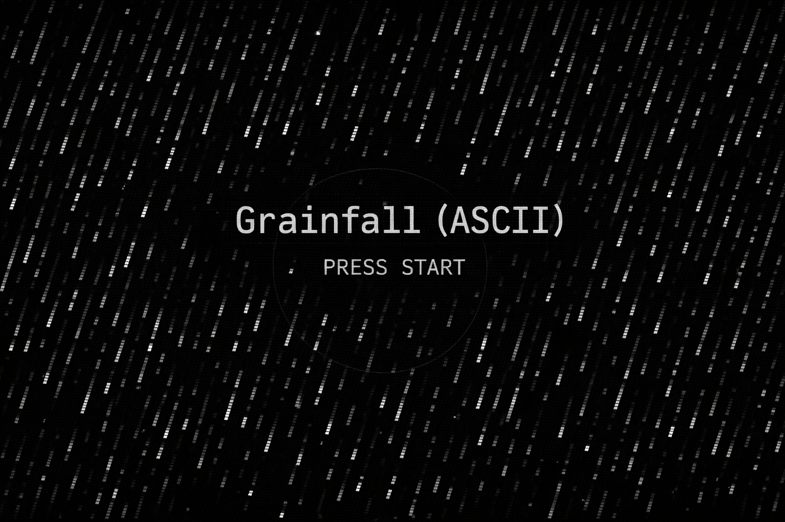

# Grainfall (ASCII)

Mini jeu type *survivor.io* en **noir & blanc style ASCII** (terrain “grain”), jouable **au clavier** et **au tactile** (mobile).



- **Démo**: [grainfall.tommy-bordas.fr](https://grainfall.tommy-bordas.fr/)

## Sommaire

- [Fonctionnalités](#fonctionnalités)
- [Stack](#stack)
- [Prérequis](#prérequis)
- [Installation](#installation)
- [Scripts](#scripts)
- [Développement](#développement)
- [Build & preview](#build--preview)
- [Structure du projet](#structure-du-projet)
- [Contrôles](#contrôles)
- [Déploiement](#déploiement)
- [Cache headers (recommandations)](#cache-headers-recommandations)
- [Contribution](#contribution)
- [Licence](#licence)

## Fonctionnalités

- **Ennemis** qui arrivent par les bords et te poursuivent (variantes + boss)
- **Tir automatique**, armes et upgrades
- **Menu** de sélection (carte / difficulté / héros)
- **High score** persistant sur l’appareil (**cookie signé**: reset si modifié)

## Stack

- **JavaScript** (vanilla)
- **Gulp** (tasks dev/build)
- **esbuild** (bundle/minify du JS)
- **BrowserSync** (serve + reload)

## Prérequis

- **Node.js** (recommandé: version LTS)
- **npm**

## Installation

```bash
npm install
```

## Scripts

- **`npm run dev`**: lance un serveur local sur `http://localhost:5173` (reload à la sauvegarde)
- **`npm run build`**: génère un build statique dans `dist/`
- **`npm run serve:dist`**: build + prévisualisation du dossier `dist/` sur `http://localhost:4173`

## Développement

```bash
npm run dev
```

Puis ouvrir `http://localhost:5173`.

## Build & preview

```bash
npm run build
```

Les fichiers prêts à déployer sont dans `dist/` avec un **bundle JS minifié** (`dist/assets/bundle.js`).

Pour tester le build localement:

```bash
npm run serve:dist
```

## Structure du projet

- **`src/`**: sources (servies telles quelles en dev)
  - `index.html`, `styles.css`, `main.js`
  - `game/`, `core/`, `render/`, `audio/`
- **`dist/`**: sortie de build (générée)
  - `assets/bundle.js`: JS bundlé/minifié (via esbuild)

## Contrôles

- **Clavier**
  - WASD/ZQSD (auto) / Flèches: déplacer
  - Entrée: démarrer
  - P: pause
  - R: recommencer
  - 1/2/3: carte — 4/5/6: difficulté — 7/8/9: héros
- **Mobile (tactile)**
  - drag en bas à gauche: déplacer (joystick)
  - bouton **PAUSE** en haut: ouvrir le menu pause

## Cache headers (recommandations)

Pour un déploiement sur un serveur “classique” (Nginx/Apache/CDN), tu veux:
- **`index.html`**: pas de cache agressif (pour récupérer les nouvelles versions)
  - `Cache-Control: no-cache` (ou `max-age=0, must-revalidate`)
- **assets** (`/assets/*`, `styles.css`, `favicon.svg`):
  - soit `Cache-Control: public, max-age=31536000, immutable` **si** tu versionnes/hashe les fichiers
  - soit un cache plus court (ex: `max-age=3600`) si les noms ne changent pas

Avec le setup actuel, `bundle.js` n’est pas hashé, donc préfère un cache court pour `dist/assets/bundle.js`
ou ajoute un hash de fichier (on peut le faire dans la build si tu veux du `immutable`).

## Déploiement

Ce projet se déploie comme un **site statique**:

- exécuter `npm run build`
- déposer le contenu de `dist/` sur ton hébergement (Nginx/Apache/CDN, GitHub Pages, etc.)
- appliquer les recommandations de cache ci-dessus (important si tu actives un CDN)

## Contribution

Les retours sont bienvenus:

- ouvrir une issue (bug, suggestion, idée d’amélioration)
- proposer une PR (idéalement: petite, ciblée, avec un descriptif clair)

## Licence

Licence **MIT** — voir le fichier [`LICENSE`](./LICENSE).


